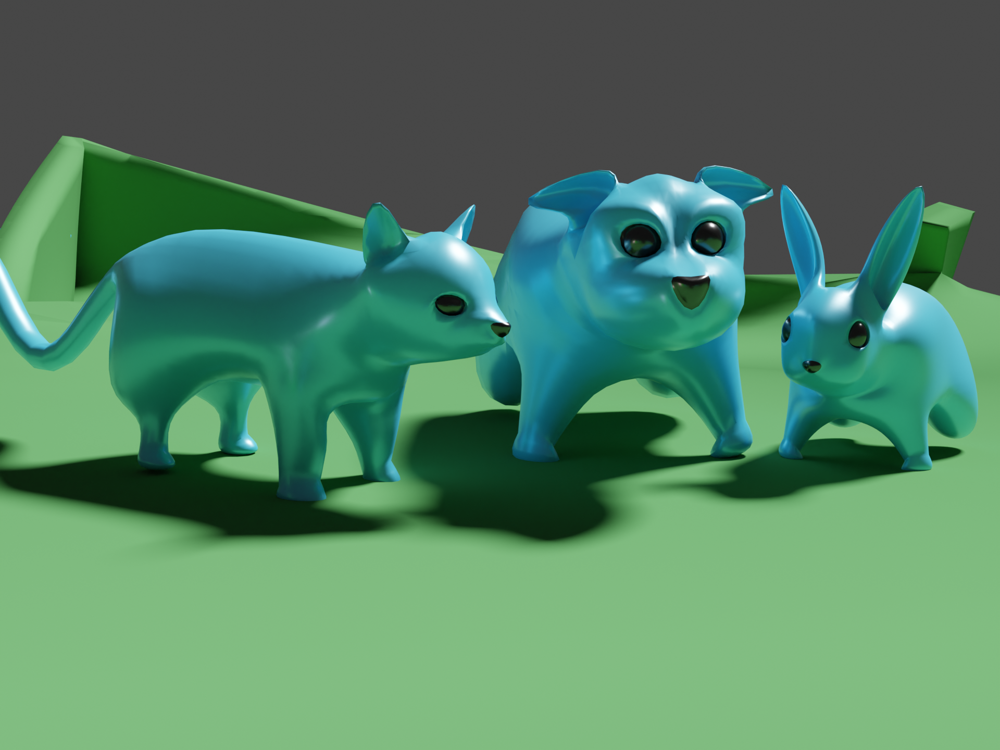

# Animal Aggregator

Collect all the animals and bring them home!

# Gameplay

🎮 Plays best on controller! 🎮

A super simple sandbox play-tested on a 20 month old toddler. She loves it. I'm sure you will too.

You start as a dog with a special ability to control any animal you touch! Combine Kitties and Bunnies into a mad herd of mischief. Don't worry if they fall, they'll come back.

Special message for those that collect all the animals :)

(This was a project done around a busy family, and a first-time project with Bevy / Rust. I'm just happy it's done :)

# Development

Fast iteration
* Run `cargo watch -x 'run'` to watch for asset changes
* Export .gltf file from Blender using custom keyboard shortcut (right-click on export option)
* Attach extra behaviours to existing scene elements, make use of labels in blender to dictate behaviour from blender files.